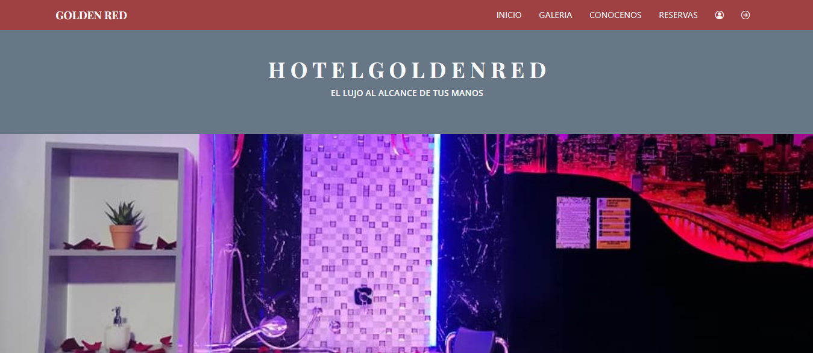
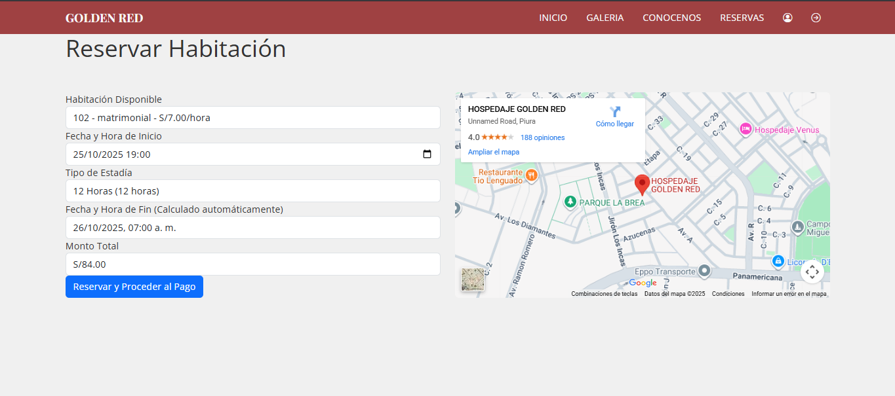
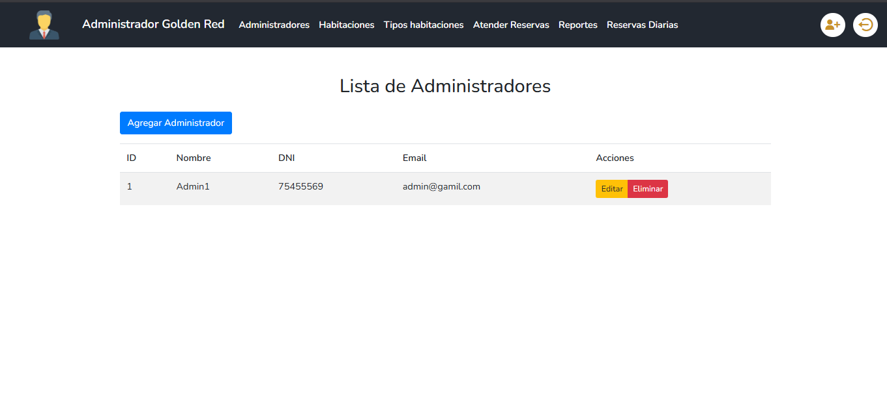
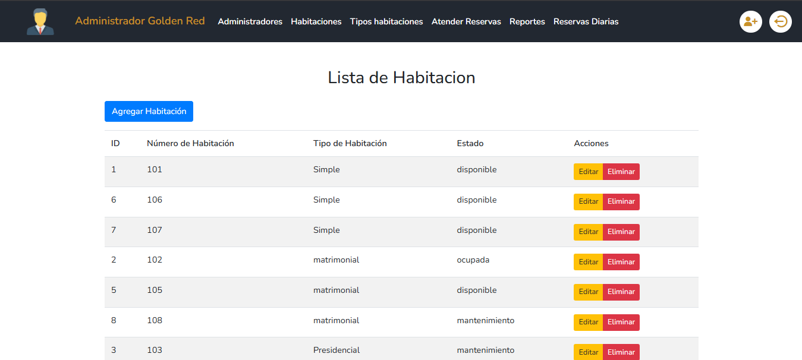
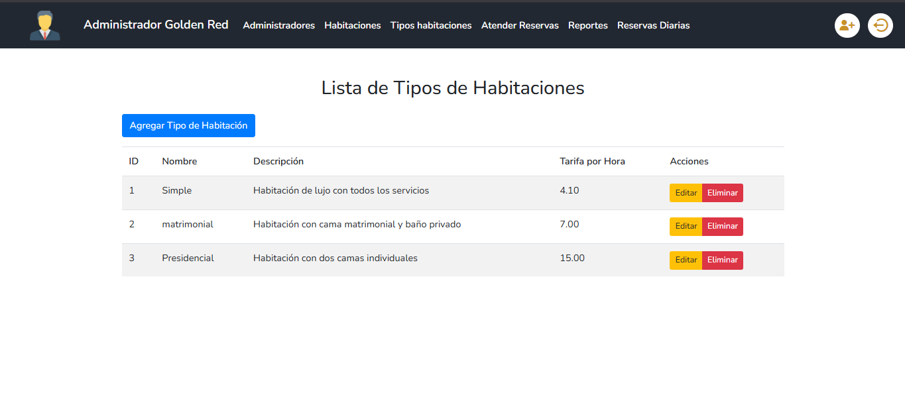
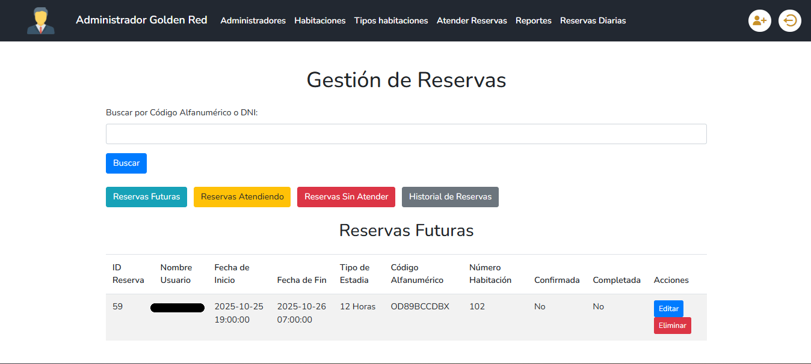
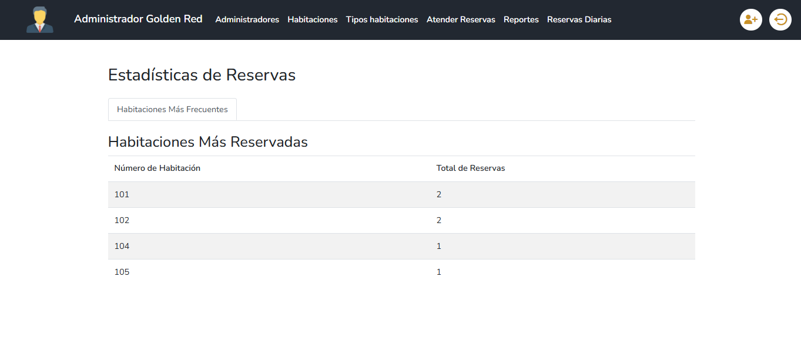
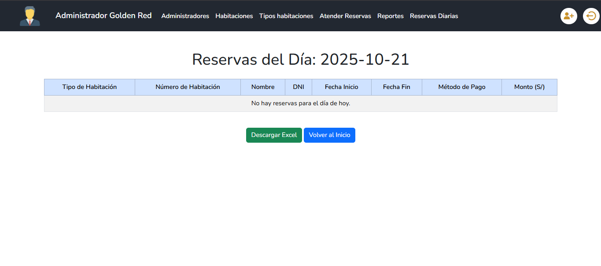
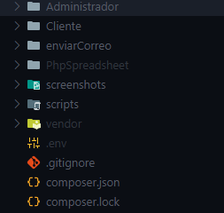

# 🏨 Sistema para la Gestión de Reservas de Habitaciones y Análisis  
### Hospedaje Golden Red

> Proyecto académico desarrollado para el **Curso Integrador 1: Sistemas Software (2024)**  
> **Carrera:** Ingeniería de Sistemas e Informática  
> **Ciclo:** VI  

---

## 📋 Descripción General

El **Sistema para la Gestión de Reservas de Habitaciones y Análisis para el Hospedaje Golden Red** fue desarrollado como proyecto académico para integrar conocimientos de **desarrollo web, bases de datos y análisis de información**.  

Permite a los **clientes** realizar reservas en línea y a los **administradores** gestionar y analizar la información del hospedaje de forma segura, rápida y centralizada.

---

## 🚀 Funcionalidades Principales

### 👤 Módulo de Cliente

El módulo del cliente ofrece una interfaz sencilla y accesible para realizar **reservas en línea**.  
Los usuarios pueden seleccionar el tipo de habitación, fecha de inicio, duración y visualizar el monto total antes de confirmar.

**Características:**
- Selección de habitación y duración (por hora).
- Cálculo automático del monto total.
- Envío de confirmación de reserva por **correo electrónico (PHPMailer)**.
- Generación de un **código alfanumérico único** para validación en recepción.

**Ejemplo visual del módulo Cliente:**

> 
>
> 
>
> 

---

### 🧑‍💼 Módulo de Administración

El módulo de administración es exclusivo para el personal autorizado del hospedaje.  
Permite gestionar las reservas, los tipos de habitación, realizar análisis de datos y generar reportes.

**Características:**
- CRUD completo de **tipos de habitación** y **habitaciones**.
- Verificación de códigos alfanuméricos y DNI de clientes.
- Panel analítico con gráficos e informes generados mediante **PhpSpreadsheet**.
- Visualización de:
  - Clientes más frecuentes.
  - Habitaciones más rentadas.

**Ejemplo visual del módulo Administrador:**

> 
>
> 
>
> 
>
> 
>
> 
>
> 
>
> 

---

## 🛠️ Tecnologías Utilizadas

| Categoría | Tecnologías |
|------------|-------------|
| **Lenguajes** | PHP, JavaScript, HTML5, CSS3 |
| **Frameworks / Librerías** | Bootstrap, PHPMailer, PhpSpreadsheet |
| **Base de Datos** | MySQL |
| **Servidor Local** | Apache (XAMPP / Laragon recomendado) |
| **Conexión Segura** | PDO (PHP Data Objects) |

---

## ⚙️ Estructura del Proyecto
>
> 
